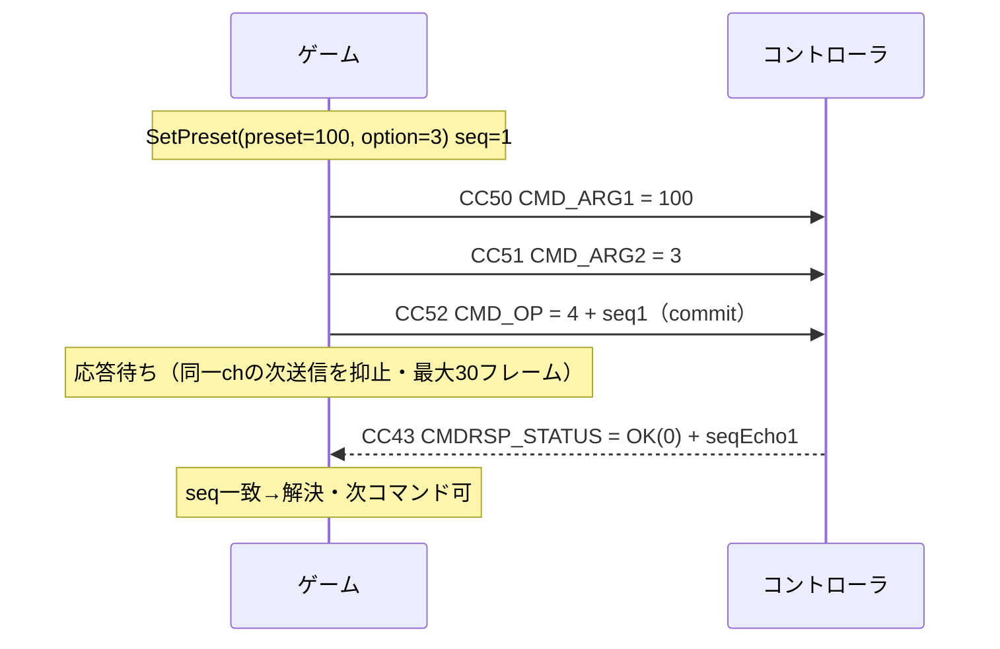
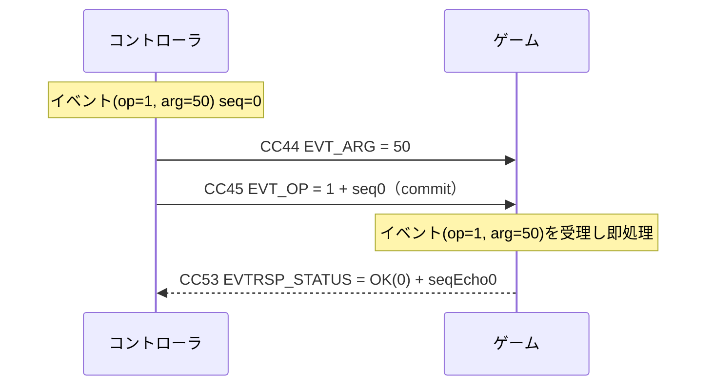
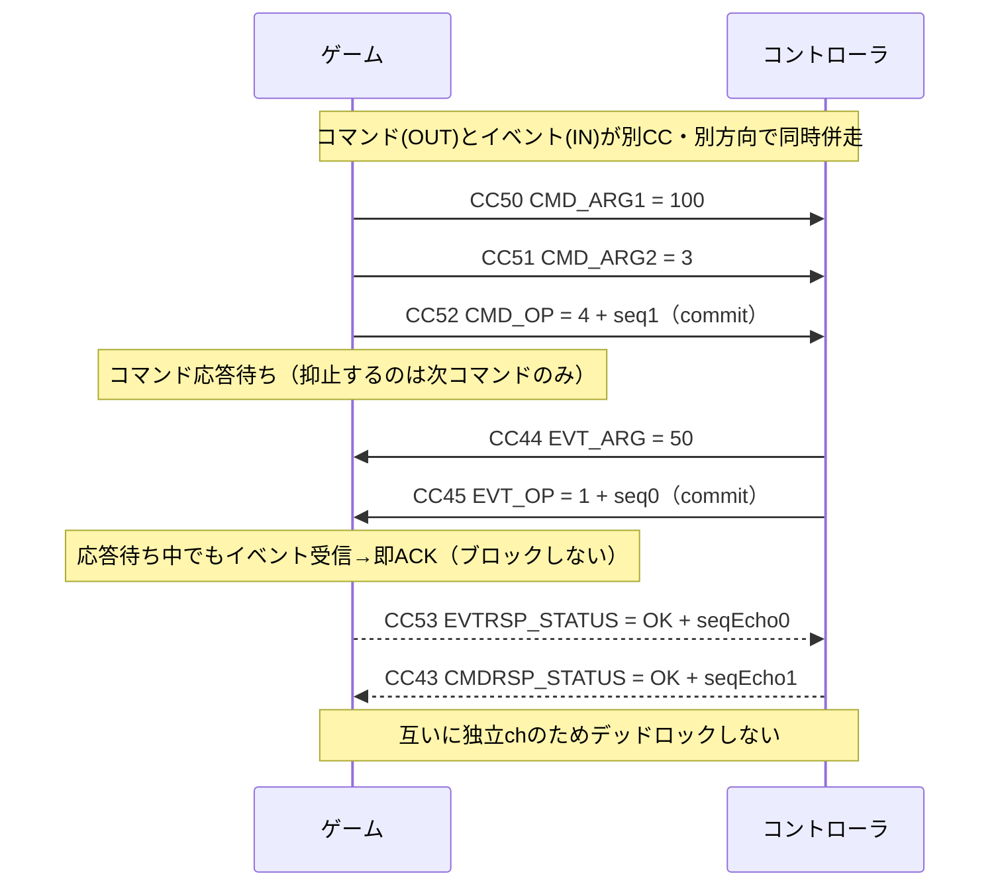
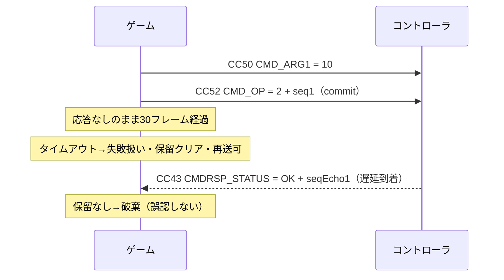

# MIDI マッピング表（Kuuhug コントローラ プロトコル仕様）

Kuuhug コントローラ ⇄ ゲーム（ホスト）間の MIDI プロトコル仕様。CC 番号の割り当て・値の解釈・イベント/応答 I/F の規約を定義する。
本書は**自己完結のプロトコル仕様**であり、ゲーム側・コントローラ（ファームウェア）側どちらの実装も本書を取り決めとして参照する。

- トランスポート: MIDI Control Change (CC) のみ（SysEx 不使用）
- MIDI チャンネル: **0**（1 始まり表記の ch1）を IN / OUT とも使用する。受信側は他チャンネルを許容してもよいが、送信は ch0 で行うこと
- 方向表記: **IN** = コントローラ → ゲーム（受信） / **OUT** = ゲーム → コントローラ（送信）
- すべて 0 始まりのインデックス（MIDI チャンネル含む）
- 最終更新: 2026-06-10

---

## 1. アナログ軸（14bit 精度・IN）

同じ CC ペア（16/48・17/49・18/50・19/51）を、**Stick モード**（双極・中央基準）と
**Slider モード**（単極・0 基準）の 2 通りで使用できる。
どちらも 14bit 生値（0–16383）の再構成までは共通で、**正規化の解釈だけが異なる**（モードの選択規約は §1-B 末尾）。

| モード | 物理デバイス | 生値の解釈      | 正規化範囲    |
| ------ | ------------ | --------------- | ------------- |
| Stick  | ジョイスティック | 中央 8192 が原点 | −1.0 … +1.0   |
| Slider | スライダー / フェーダー | 0 が最小・16383 が最大 | 0.0 … 1.0 |

### 1-A. Stick モード（双極・−1.0 … +1.0）

各軸は **MSB / LSB の 2 本の CC** で送られ、`14bit = MSB * 128 + LSB`（0–16383）として再構成。
中央値 `8192` を基準に `-1.0 … +1.0` へ正規化・クランプする。

> **なぜ 2 本の CC を使うのか:** MIDI の CC 値は 0–127（7bit）しか表せず、スティックには粗すぎる。
> そこで **MSB（上位 7bit）と LSB（下位 7bit）の 2 本**を組み合わせて 14bit（0–16383）の高精度にする。
>
> **LSB 番号の由来:** MIDI 標準の慣習で「CC 0–31 の MSB に対し、その番号 +32 を LSB に割り当てる」。
> 本仕様もこれに従い、左 X の MSB=16 → LSB=16+32=**48**、以降 17→49 / 18→50 / 19→51 とペアになる。
> 表記 `16/48` は「MSB=16, LSB=48 のペアで 1 軸」という意味。

| 入力       | 軸 | MSB CC | LSB CC | 範囲(14bit) | 正規化後      |
| ---------- | -- | ------ | ------ | ----------- | ------------- |
| 左スティック | X  | **16** | **48** | 0–16383     | −1.0 … +1.0   |
| 左スティック | Y  | **17** | **49** | 0–16383     | −1.0 … +1.0   |
| 右スティック | X  | **18** | **50** | 0–16383     | −1.0 … +1.0   |
| 右スティック | Y  | **19** | **51** | 0–16383     | −1.0 … +1.0   |

**正規化式（双極）:**

```
v = MSB * 128 + LSB            // 0 … 16383
n = (v - 8192) / 8192          // 中央 8192 を 0 に
result = clamp(n, -1.0, +1.0)
```

### 1-B. Slider モード（単極・0.0 … 1.0）

スライダー / フェーダー型コントローラ向け。同じ CC ペアを使うが、中央基準ではなく
**0–16383 の生値を 0.0 … 1.0 に線形正規化**する。

| Slider  | 14bit (MSB / LSB) | 生値    | 正規化      |
| ------- | ----------------- | ------- | ----------- |
| Slider1 | CC 16 / 48        | 0–16383 | 0.0 … 1.0   |
| Slider2 | CC 17 / 49        | 0–16383 | 0.0 … 1.0   |
| Slider3 | CC 18 / 50        | 0–16383 | 0.0 … 1.0   |
| Slider4 | CC 19 / 51        | 0–16383 | 0.0 … 1.0   |

**正規化式（単極）:**

```
v = MSB * 128 + LSB                  // 0 … 16383
result = clamp(v / 16383, 0.0, 1.0)  // 0.0 … 1.0
```

> **CC 対応:** Slider1↔左X / Slider2↔左Y / Slider3↔右X / Slider4↔右Y と同一 CC を共有する。
> Stick モードと Slider モードは同じ CC を流れるため**同時併用は不可**。
>
> **モードの選択はワイヤ外の事前合意:** ワイヤ上にモードを通知する CC は存在しない。接続するコントローラの
> 種別（スティック型かスライダー型か）に合わせてどちらで運用するかを事前に取り決め、**受信側（ゲーム）が
> 正規化の解釈を切り替える**。コントローラが自己申告してモードが自動で切り替わる仕組みは無い。

---

## 2. ボタン（10 個・IN）

ボタン 0–9 は単一 CC。値が **しきい値 64 以上で ON**、未満で OFF。
ワイヤ上を流れるのは ON/OFF のレベル情報のみで、Down/Up エッジの検出は受信側実装の責務。

| ボタン | CC | ON 条件        |
| ------ | -- | -------------- |
| 0      | 20 | value ≥ 64     |
| 1      | 21 | value ≥ 64     |
| 2      | 22 | value ≥ 64     |
| 3      | 23 | value ≥ 64     |
| 4      | 24 | value ≥ 64     |
| 5      | 25 | value ≥ 64     |
| 6      | 26 | value ≥ 64     |
| 7      | 27 | value ≥ 64     |
| 8      | 28 | value ≥ 64     |
| 9      | 29 | value ≥ 64     |

### ボタン予約帯（CC 20–39）

将来のボタン追加に備え、**CC 20–39 の 1 ディケードをボタン専用の予約帯**とする。
これにより最大 20 個まで、Preset/State の番号体系を崩さず拡張できる。

| ボタン index | CC      | 状態          |
| ------------ | ------- | ------------- |
| 0–9          | 20–29   | 使用中        |
| 10–19        | 30–39   | 予約（未使用） |

---

## 3. Preset（0–127・IN）

コントローラ側の現在の Preset 番号を、単一 CC・**0–127 の生値**で受信する（量子化なし）。

| 入力   | CC | MIDI 範囲 |
| ------ | -- | --------- |
| Preset | 40 | 0–127     |

---

## 4. Error（0–127・IN）

コントローラ側のエラーコードを **0–127 の生値**で受信する。量子化せずそのまま使用する。

| 入力  | CC | MIDI 範囲 |
| ----- | -- | --------- |
| Error | 41 | 0–127     |

---

## 5. State（0–127・IN）

コントローラ側の状態コードを **0–127 の生値**で受信する。量子化せずそのまま使用する。

| 入力  | CC | MIDI 範囲 |
| ----- | -- | --------- |
| State | 42 | 0–127     |

---

## 6. Preset 送信（OUT・SetPreset コマンド）

Preset 送信は専用 CC ではなく、イベント/応答 I/F（§7）の **SetPreset コマンド**（opcode = 4）として送る（ACK 付き）。
**オプション値（0–127）を同時に渡せる**。構成 CC は 3 本（引数 2 本 + commit）：

| 役割            | CC | 値                | 意味         |
| --------------- | -- | ----------------- | ------------ |
| arg1 (CMD_ARG1)  | 50 | 0–127             | Preset 値    |
| arg2 (CMD_ARG2) | 51 | 0–127             | オプション値 |
| commit (CMD_OP) | 52 | opcode 4 + seq×64 | SetPreset 確定 |

- 送信順 `ARG1 → ARG2 → OP`。コントローラは `CMDRSP_STATUS`(CC43) で ACK（`0 OK` / `2 INVALID_ARG`）を返す。
- 送受信は**非対称**：Preset 受信は生 CC40（§3・IN）、送信は本コマンド（OUT）。
- **option(arg2) の意味はアプリ定義（例: バンク / 対象チャンネル等）で現状は予約**。受信側の解釈は未確定のため送信側は当面 `0` を推奨。`INVALID_ARG` は arg1 / arg2 のどちらが不正かを区別しない（必要なら STATUS を拡張）。
- **エコーバックは未規定**：SetPreset 成功後にコントローラが新しい現在値を CC40（§3・IN）で通知し直すかは定めない（コントローラ実装依存）。ゲーム側は CC40 受信を常時受け付けるため、通知の有無いずれでも動作する。

---

## 7. イベント/応答 I/F（双方向メッセージング）

ゲーム⇄コントローラで構造化メッセージをやり取りするための I/F。
**同期・単一メッセージ + 1bit シーケンス**方式で、CC のみを使う（SysEx 不要）。

- **コマンド**: ゲーム→コントローラの要求。コントローラが応答（ACK）を返す。
- **イベント**: コントローラ→ゲームの要求。ゲームが応答（ACK）を返す。
- コマンド系とイベント系は**別 CC・別方向の独立チャンネル**で、同時併走（クロス）しても安全。

### フレーム構成

- **コマンド要求フレーム（OUT）** = `(ARG1, ARG2, OP)` … OP の到着が commit（`ARG2` は任意・既定 0）
- **イベント要求フレーム（IN）** = `(ARG, OP)` … OP の到着が commit（引数は 1 本のみ。ARG2 に相当する CC は無い）
- **応答フレーム（双方向）** = `(STATUS)` … STATUS の到着が commit

OP / STATUS の値に **bit6（値 64）をシーケンスビット**として埋め込む（本体は bit0–5 = 0–63）：

```
OP 値      = opcode(0–63) + seq×64
STATUS 値  = status(0–63) + seqEcho×64
```

### CC 割り当て（計 7 本）

**OUT（ゲーム→コントローラ）** — コマンド系（50–52）は送信順＝CC 番号順
| CC | 名称 | 値の構成 | commit |
| -- | ---- | -------- | ------ |
| 50 | CMD_ARG1 | 第1引数 0–127 | |
| 51 | CMD_ARG2 | 第2引数 0–127（任意・既定0） | |
| 52 | CMD_OP | opcode(0–63) + seq×64 | ✓ |
| 53 | EVTRSP_STATUS | status(0–63) + seqEcho×64 | ✓ |

**IN（コントローラ→ゲーム）**
| CC | 名称 | 値の構成 | commit |
| -- | ---- | -------- | ------ |
| 43 | CMDRSP_STATUS | status(0–63) + seqEcho×64 | ✓ |
| 44 | EVT_ARG | 引数 0–127 | |
| 45 | EVT_OP | opcode(0–63) + seq×64 | ✓ |

> **CC 方向重複（疎通試験時の注意）:** OUT のコマンド CC は IN 側と番号が重複する — `CMD_ARG1=50` / `CMD_ARG2=51` は右スティック LSB（右X=50・右Y=51, §1）と同番号。MIDI は IN/OUT が独立エンドポイントのため**実機（物理 IN/OUT 分離）では無害**。ただし**ループバック / 単一仮想ポートで疎通試験する場合、自分が送った OUT がスティック LSB 等として自プロセスへ誤注入されうる**。試験時は IN/OUT を別ポートにするか自己エコーを無視すること（ループバック接続は非対応）。

### 送受信規約

- 送信は `ARG →(ARG2)→ OP` の順（`ARG2` はコマンドのみ・イベントは `ARG` 1 本）。受信側は **OP の到着ごと**に直前の ARG/ARG2 と合わせて 1 件として実行し、**実行後に ARG/ARG2 を消費（クリア）** する（次の要求で送られなかった引数は 0。前の要求の値は残さない）。送信側は各要求で必要な引数を毎回送る。値変化ではなく CC メッセージ到着で発火するため、同値連続の要求も取りこぼさない。
- 送信側は要求ごとに **seq を 0↔1 反転**する。応答の seqEcho が保留中の seq と一致しなければ**破棄**（タイムアウト後に遅れて来た古い応答の誤認を防ぐ）。
- **「応答待ち」がブロックするのは同一チャンネルの次送信のみ**。相手からの受信・応答は常時実行する（クロス時もデッドロックしない）。
- 保留要求の無いチャンネルに届いた応答（STATUS）は破棄する。
- 応答のタイムアウト既定は **30 フレーム（≒0.5s @60fps）**。ここでの「フレーム」は**送信側の処理サイクル（毎フレーム実行される送受信処理）の回数**であり、**実時間ではない**。送信側の処理が停止・間引きされている間はタイムアウトも進まないため、実時間 0.5 秒の応答期限を保証するものではない（応答側は即時 ACK を返すこと。実時間の期限には依存しない）。超過で失敗扱いとし、その後に再送可。
- 状態を書き換えるコマンド（例 SetPreset）は **last-write-wins**。1bit seq の稀な誤認（後述「2 連続タイムアウト＋超遅延応答」）が起きても次回送信で上書き訂正され恒久的な不整合は残らない。厳密な一回性が要る用途は 2bit seq 等への拡張を検討。

### コード値

**STATUS（bit0–5）**
| 値 | 意味 |
| -- | ---- |
| 0 | OK（受領/完了） |
| 1 | UNKNOWN_OP（未知オペコード） |
| 2 | INVALID_ARG（引数不正） |
| 3 | REJECTED（拒否） |
| 4–63 | 予約 |

**opcode（bit0–5・コマンドとイベントで別名前空間）**
| OP | コマンド (OUT) | イベント (IN) |
| -- | -------------- | ------------- |
| 0 | Ping | HeartBeat |
| 1 | LED 制御 | ButtonCombo |
| 2 | Haptic | SensorTrigger |
| 4 | **SetPreset**（arg1=preset / arg2=option） | — |
| 3, 5–63 | 予約 | 予約 |

> **SetPreset (4) 以外の opcode は例示**（未確定）。opcode を追加・確定したら本表を更新する。

### クロス時の挙動

| ケース | 挙動 |
| ------ | ---- |
| コマンドとイベントが同時併走 | 別 CC・別方向のため安全。各側は応答待ち中も受信ハンドラを生かし即応答 |
| タイムアウト→単発の遅延応答 | seq 不一致で破棄され誤認しない |
| 2 連続タイムアウト＋超遅延応答 | 稀に誤認余地が残る（1bit seq の限界・低頻度前提で許容） |

### シーケンス図

矢印は CC メッセージ。実線=要求、破線=応答(ACK)。`commit` は OP/STATUS 到着で 1 件確定。

#### コマンド送受信（例: SetPreset・2 引数 + ACK）



#### イベント送受信（コントローラ→ゲーム + 即 ACK）



#### クロス（コマンドとイベントの同時併走・デッドロックしない）



#### タイムアウトと遅延応答の破棄



---

## 早見表（CC 一覧）

| CC      | 用途                       | 方向 |
| ------- | -------------------------- | ---- |
| 16 / 48 | 左スティック X (MSB / LSB) | IN   |
| 17 / 49 | 左スティック Y (MSB / LSB) | IN   |
| 18 / 50 | 右スティック X (MSB / LSB) | IN   |
| 19 / 51 | 右スティック Y (MSB / LSB) | IN   |
| 20–29   | ボタン 0–9                 | IN   |
| 30–39   | ボタン 10–19（予約・未使用） | IN   |
| 40      | Preset (受信・0–127)       | IN   |
| 41      | Error (受信・0–127)        | IN   |
| 42      | State (受信・0–127)        | IN   |
| 43      | CMDRSP_STATUS (コマンド応答) | IN |
| 44      | EVT_ARG (イベント引数)      | IN |
| 45      | EVT_OP (イベント op+seq)    | IN |
| 50      | CMD_ARG1 (コマンド第1引数)   | OUT |
| 51      | CMD_ARG2 (コマンド第2引数)   | OUT |
| 52      | CMD_OP (コマンド op+seq)    | OUT |
| 53      | EVTRSP_STATUS (イベント応答) | OUT |
