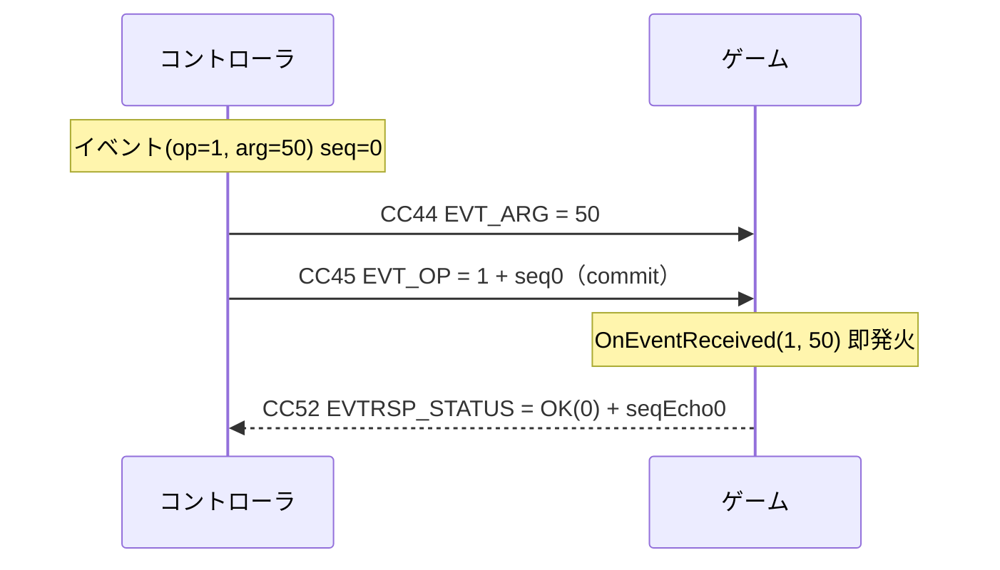

> **このリポジトリでの位置づけ（pyMidiSimulator）:** 本ファイルは Unity プロジェクト
> `TestMIDIGameController` の `docs/specs/midi-mapping.md`（正典: `Packages/com.ckd.kuuhug-controller/Runtime/Internal/CcMap.cs`）の
> スナップショット（参照用コピー）です。pyMidiSimulator はこの仕様に基づく**コントローラ役**シミュレータで、
> CC 番号・送受信方向・seq/ACK・タイムアウト境界などはこのファイルを唯一の照合先とします。
> 仕様書は Unity 受信側の視点で「IN / OUT」を定義しているため、本シミュレータ（送信主体）では送受信が反転します
> （仕様の「IN」= シミュレータの送信、「OUT」= シミュレータの受信）。Unity 側の仕様が更新された場合は本ファイルも同期してください。
> 設計の詳細は `docs/superpowers/specs/2026-06-09-controller-sim-new-midi-spec-design.md` を参照。

---

# MIDI マッピング表

CkdGameController（旧 `MIDIInputProvider`）の MIDI ⇄ ゲーム入力対応表。

**単一の真実 (Single Source of Truth):** `Packages/com.ckd.kuuhug-controller/Runtime/Internal/CcMap.cs`
CC 番号・しきい値・量子化はすべて `CcMap` の定数で定義され、この表はそのスナップショット。値を変更する場合は `CcMap.cs` を編集し、本表を更新すること。

- MIDI チャンネル: Control Change (CC) ベース
- すべて 0 始まりのインデックス
- 最終更新: 2026-06-09

---

## 1. アナログ軸（14bit 精度・受信 IN）

同じ CC ペア（16/48・17/49・18/50・19/51）を、コントローラ側の設定により
**Stick モード**（双極・中央基準）と **Slider モード**（単極・0 基準）の 2 通りで使用できる。
どちらも 14bit 生値（0–16383）の再構成までは共通で、**正規化の解釈だけが異なる**。

| モード | 物理デバイス | 生値の解釈      | 正規化範囲    |
| ------ | ------------ | --------------- | ------------- |
| Stick  | ジョイスティック | 中央 8192 が原点 | −1.0 … +1.0   |
| Slider | スライダー / フェーダー | 0 が最小・16383 が最大 | 0.0 … 1.0 |

### 1-A. Stick モード（双極・−1.0 … +1.0）

各軸は **MSB / LSB の 2 本の CC** で送られ、`14bit = MSB * 128 + LSB`（0–16383）として再構成。
中央値 `8192` を基準に `-1.0 … +1.0` へ正規化・クランプする。

> **なぜ 2 本の CC を使うのか:** MIDI の CC 値は 0–127（7bit）しか表せず、スティックには粗すぎる。
> そこで **MSB（上位 7bit）と LSB（下位 7bit）の 2 本**を組み合わせて 14bit（0–16383）の高精度にする。
>
> **LSB 番号の由来:** MIDI 標準の慣習で「CC 0–31 の MSB に対し、その番号 +32 を LSB に割り当てる」。
> 本プロジェクトもこれに従い、左 X の MSB=16 → LSB=16+32=**48**、以降 17→49 / 18→50 / 19→51 とペアになる。
> 表記 `16/48` は「MSB=16, LSB=48 のペアで 1 軸」という意味。

| 入力       | 軸 | MSB CC | LSB CC | 範囲(14bit) | 正規化後      |
| ---------- | -- | ------ | ------ | ----------- | ------------- |
| 左スティック | X  | **16** | **48** | 0–16383     | −1.0 … +1.0   |
| 左スティック | Y  | **17** | **49** | 0–16383     | −1.0 … +1.0   |
| 右スティック | X  | **18** | **50** | 0–16383     | −1.0 … +1.0   |
| 右スティック | Y  | **19** | **51** | 0–16383     | −1.0 … +1.0   |

**正規化式 (`CcMap.Norm14`):**

```
v = MSB * 128 + LSB            // 0 … 16383
n = (v - 8192) / 8192          // 中央 8192 を 0 に
result = clamp(n, -1.0, +1.0)
```

- 中央定数: `CENTER_14BIT = 8192`
- 割り当て: Player1 = 左スティック / Player2 = 右スティック

### 1-B. Slider モード（単極・0.0 … 1.0）

スライダー / フェーダー型コントローラ向け。同じ CC ペアを使うが、中央基準ではなく
**0–16383 の生値を 0.0 … 1.0 に線形正規化**する。

| Slider  | 14bit (MSB / LSB) | 生値    | 正規化      |
| ------- | ----------------- | ------- | ----------- |
| Slider1 | CC 16 / 48        | 0–16383 | 0.0 … 1.0   |
| Slider2 | CC 17 / 49        | 0–16383 | 0.0 … 1.0   |
| Slider3 | CC 18 / 50        | 0–16383 | 0.0 … 1.0   |
| Slider4 | CC 19 / 51        | 0–16383 | 0.0 … 1.0   |

**正規化式（単極）:**

```
v = MSB * 128 + LSB            // 0 … 16383
result = v / 16383             // 0.0 … 1.0
```

> **CC 対応:** Slider1↔左X / Slider2↔左Y / Slider3↔右X / Slider4↔右Y と同一 CC を共有する。
> Stick モードと Slider モードは同じ CC を流れるため**同時併用は不可**。コントローラ側の Type 設定でどちらか一方を選ぶ。

---

## 2. ボタン（10 個・受信 IN）

ボタン 0–9 は単一 CC。値が **しきい値 64 以上で ON**、未満で OFF。
Down / Up エッジは受信側の `Tick()` で解決される。

| ボタン | CC | ON 条件        |
| ------ | -- | -------------- |
| 0      | 20 | value ≥ 64     |
| 1      | 21 | value ≥ 64     |
| 2      | 22 | value ≥ 64     |
| 3      | 23 | value ≥ 64     |
| 4      | 24 | value ≥ 64     |
| 5      | 25 | value ≥ 64     |
| 6      | 26 | value ≥ 64     |
| 7      | 27 | value ≥ 64     |
| 8      | 28 | value ≥ 64     |
| 9      | 29 | value ≥ 64     |

- しきい値定数: `BUTTON_ON_THRESHOLD = 64`
- CC 配列: `CcMap.ButtonCCs = { 20 … 29 }`（現在の実装は 0–9 の 10 個のみ）

### ボタン予約帯（CC 20–39）

将来のボタン追加に備え、**CC 20–39 の 1 ディケードをボタン専用の予約帯**とする。
これにより最大 20 個まで、Preset/State の番号体系を崩さず拡張できる。

| ボタン index | CC      | 状態          |
| ------------ | ------- | ------------- |
| 0–9          | 20–29   | 実装済み      |
| 10–19        | 30–39   | 予約（未使用） |

---

## 3. Preset（0–127・受信 IN）

単一 CC で **0–127 の生値**を受信する。量子化しない（旧仕様の 0–16 量子化は廃止）。

| 入力   | CC | MIDI 範囲 |
| ------ | -- | --------- |
| Preset | 40 | 0–127     |

> **実装済み（2026-06-09）:** Preset は `CcMap.PRESET_CC = 40` で受信し、**生値 0–127**（量子化なし・`_state.preset = v`）。
> 旧仕様の CC30 量子化（0–16）は廃止。これに伴い `CcMap.MidiValueToPreset` / `PresetToMidiValue` / `STATE_MAX` は Preset では未使用（コード上は残置）。

---

## 4. Error（0–127・受信 IN）

コントローラ側のエラーコードを **0–127 の生値**で受信する。量子化せずそのまま使用する。

| 入力  | CC | MIDI 範囲 |
| ----- | -- | --------- |
| Error | 41 | 0–127     |

> **実装済み（2026-06-09）:** Error は `CcMap.ERROR_CC = 41` で受信、生値 0–127 を `CkdGameController.Error` で読める。

---

## 5. State（0–127・受信 IN）

コントローラ側の状態コードを **0–127 の生値**で受信する。量子化せずそのまま使用する。

| 入力  | CC | MIDI 範囲 |
| ----- | -- | --------- |
| State | 42 | 0–127     |

> **実装済み（2026-06-09）:** State は `CcMap.STATE_CC = 42` で受信、生値 0–127 を `CkdGameController.State` で読める（旧 CC30=Preset とは別物）。

---

## 6. Preset 送信（OUT・コマンド経由）

> **設計変更（2026-06-09）:** 旧「CC40 OUT・受信と対称の専用送信」は**廃止**。Preset 送信は
> イベント/応答 I/F の **SetPreset コマンド**（セクション 7）として送る（ACK 付き）。これにより
> **オプション値（0–127）を同時に渡せる**。
> **実装済み（2026-06-09）:** `MidiBackend.SendSetPreset(preset, option)` → `SendCommand(OP_SET_PRESET=4, preset, option)` で送る（公開 API `CkdGameController.SetPreset(preset, option=0)`）。旧 `SendPreset`→`CC40 OUT` は廃止。Preset **受信**（セクション 3・CC40 IN）は不変。

Preset 送信は **SetPreset コマンド**（opcode = 4）で送る。引数は 2 本：

| 引数            | CC | 値                | 意味         |
| --------------- | -- | ----------------- | ------------ |
| arg1 (CMD_ARG1)  | 50 | 0–127             | Preset 値    |
| arg2 (CMD_ARG2) | 53 | 0–127             | オプション値 |
| commit (CMD_OP) | 51 | opcode 4 + seq×64 | SetPreset 確定 |

- 送信順 `ARG → ARG2 → OP`。コントローラは `CMDRSP_STATUS`(CC43) で ACK（`0 OK` / `2 INVALID_ARG`）。
- 送受信は**非対称**：受信は生 CC40(IN)、送信は SetPreset コマンド（旧 CC40 対称送信は廃止）。
- **option(arg2) の意味はアプリ定義（例: バンク / 対象チャンネル等）で現状は予約**。受信側の解釈は未確定のため送信側は当面 `0` を推奨。`INVALID_ARG` は arg1 / arg2 のどちらが不正かを区別しない（必要なら STATUS を拡張）。

---

## 7. イベント/応答 I/F（双方向メッセージング）

ゲーム⇄コントローラで構造化メッセージをやり取りするための I/F。
**同期・単一メッセージ + 1bit シーケンス**方式で、CC のみを使う（SysEx 不要）。

- **コマンド**: ゲーム→コントローラの要求。コントローラが応答（ACK）を返す。
- **イベント**: コントローラ→ゲームの要求。ゲームが応答（ACK）を返す。
- コマンド系とイベント系は**別 CC・別方向の独立チャンネル**で、同時併走（クロス）しても安全。

> **実装済み（2026-06-09）:** 送受信機構（**2 引数コマンド対応**）を実装 — CC 定数（43/44/45/50/51/52/53）、seq 同梱コーデック
> （`CcMap.PackSeq`/`Payload`/`Seq`）、ステートマシン（`MidiBackend.SendCommand`(ARG1→ARG2→OP) / CMDRSP・EVT 受信 / 即 ACK / タイムアウト）、
> 公開 API（`CkdGameController.SendCommand(opcode,arg1,arg2=0)` / `SetPreset(preset,option=0)` / `OnCommandResponse` / `OnEventReceived`）。
> SetPreset コマンド（opcode=4・arg1=preset / arg2=option）も実装済み（セクション 6）。

### フレーム構成

- **要求フレーム** = `(ARG, ARG2, OP)` … OP の到着が commit（`ARG2` は任意・既定 0）
- **応答フレーム** = `(STATUS)` … STATUS の到着が commit

OP / STATUS の値に **bit6（値 64）をシーケンスビット**として埋め込む（本体は bit0–5 = 0–63）：

```
OP 値      = opcode(0–63) + seq×64
STATUS 値  = status(0–63) + seqEcho×64
```

### CC 割り当て（計 7 本）

**OUT（ゲーム→コントローラ）**
| CC | 名称 | 値の構成 | commit |
| -- | ---- | -------- | ------ |
| 50 | CMD_ARG1 | 第1引数 0–127 | |
| 53 | CMD_ARG2 | 第2引数 0–127（任意・既定0） | |
| 51 | CMD_OP | opcode(0–63) + seq×64 | ✓ |
| 52 | EVTRSP_STATUS | status(0–63) + seqEcho×64 | ✓ |

**IN（コントローラ→ゲーム）**
| CC | 名称 | 値の構成 | commit |
| -- | ---- | -------- | ------ |
| 43 | CMDRSP_STATUS | status(0–63) + seqEcho×64 | ✓ |
| 44 | EVT_ARG | 引数 0–127 | |
| 45 | EVT_OP | opcode(0–63) + seq×64 | ✓ |

> **CC 方向重複（疎通試験時の注意）:** OUT のコマンド CC は IN 側と番号が重複する — `CMD_ARG1=50` / `CMD_OP=51` は右スティック LSB（右X=50・右Y=51, §1）と同番号、移行期は `CC40` も Preset の IN/OUT 同番号（§6）。MIDI は IN/OUT が独立エンドポイントのため**実機（物理 IN/OUT 分離）では無害**。ただし**ループバック / 単一仮想ポートで疎通試験する場合、自分が送った OUT がスティック LSB 等として自プロセスへ誤注入されうる**。試験時は IN/OUT を別ポートにするか自己エコーを無視すること。完全分離が必要なら OUT を未使用帯（例 54–56）へ移す案もあるが、実装済みの `CMD_ARG1_CC=50` / `CMD_OP_CC=51`（`CcMap.cs`）の変更を伴う。

### 送受信規約

- 送信は `ARG →(ARG2)→ OP` の順。受信側は **OP の到着ごと**に直前の ARG/ARG2 と合わせて 1 件として実行し、**実行後に ARG/ARG2 を消費（クリア）** する（次コマンドで送られなかった引数は 0。前コマンドの値は残さない）。送信側は各コマンドで必要な引数を毎回送る。値変化ではなく CC メッセージ到着で発火するため、同値連続の要求も取りこぼさない。
- 送信側は要求ごとに **seq を 0↔1 反転**する。応答の seqEcho が保留中の seq と一致しなければ**破棄**（タイムアウト後に遅れて来た古い応答の誤認を防ぐ）。
- **「応答待ち」がブロックするのは同一チャンネルの次送信のみ**。相手からの受信・応答は常時実行する（クロス時もデッドロックしない）。
- 保留要求の無いチャンネルに届いた応答（STATUS）は破棄する。
- タイムアウト既定 **30 フレーム（≒0.5s @60fps）**・定数化。Flush(Tick) 駆動のフレーム計数で実秒換算しない。可変フレームレート（WebGL の背景タブ等で Tick が間引かれる）では実時間が伸縮するが、Tick が止まれば待ちも進まず取りこぼさない。実時間厳守が要るなら ms 併用を検討。超過で失敗扱いとし、その後に再送可。
- 状態を書き換えるコマンド（例 SetPreset）は **last-write-wins**。1bit seq の稀な誤認（後述「2 連続タイムアウト＋超遅延応答」）が起きても次回送信で上書き訂正され恒久的な不整合は残らない。厳密な一回性が要る用途は 2bit seq 等への拡張を検討。

### コード値

**STATUS（bit0–5）**
| 値 | 意味 |
| -- | ---- |
| 0 | OK（受領/完了） |
| 1 | UNKNOWN_OP（未知オペコード） |
| 2 | INVALID_ARG（引数不正） |
| 3 | REJECTED（拒否） |
| 4–63 | 予約 |

**opcode（bit0–5・例示／コマンドとイベントで別名前空間）**
| OP | コマンド (OUT) | イベント (IN) |
| -- | -------------- | ------------- |
| 0 | Ping | HeartBeat |
| 1 | LED 制御 | ButtonCombo |
| 2 | Haptic | SensorTrigger |
| 4 | **SetPreset**（arg1=preset / arg2=option） | — |
| 3, 5–63 | 予約 | 予約 |

> opcode の確定は実装時（**SetPreset=4** は本設計で確定）。Preset 送信は本体系の SetPreset コマンドで行う（旧 CC40 専用送信は廃止・セクション 6）。

### クロス時の挙動

| ケース | 挙動 |
| ------ | ---- |
| コマンドとイベントが同時併走 | 別 CC・別方向のため安全。各側は応答待ち中も受信ハンドラを生かし即応答 |
| タイムアウト→単発の遅延応答 | seq 不一致で破棄され誤認しない |
| 2 連続タイムアウト＋超遅延応答 | 稀に誤認余地が残る（1bit seq の限界・低頻度前提で許容） |

### シーケンス図

矢印は CC メッセージ。実線=要求、破線=応答(ACK)。`commit` は OP/STATUS 到着で 1 件確定。

#### コマンド送受信（例: SetPreset・2 引数 + ACK）


#### イベント送受信（コントローラ→ゲーム + 即 ACK）



#### クロス（コマンドとイベントの同時併走・デッドロックしない）


#### タイムアウトと遅延応答の破棄


---

## 8. キーボードシミュレーション（MIDI ハード無し検証用）

MIDI ハードが無い環境向けの開発用キー割り当て。
実機 MIDI 接続中（`device.IsDeviceConnected`）は**入力シミュ**を抑止し実機入力を上書きしない。Preset 送信・コマンド送信などの **OUT 操作は入力上書きではないため実機接続中も実行**する（実 OUT 未接続時は MidiBackend 側で no-op）。
ソース: `Packages/com.ckd.kuuhug-controller/Samples~/KeyboardSimulation/KeyboardSimulation.cs`

### スティック

| キー | 動作            |
| ---- | --------------- |
| `1`  | 左スティック X+ |
| `2`  | 左スティック X− |
| `3`  | 左スティック Y+ |
| `4`  | 左スティック Y− |
| `5`  | 右スティック X+ |
| `6`  | 右スティック X− |
| `7`  | 右スティック Y+ |
| `8`  | 右スティック Y− |
| `0`  | 全軸を中央に戻す |

### ボタン（押下で ON / 離上で OFF）

| キー | ボタン | キー | ボタン |
| ---- | ------ | ---- | ------ |
| `Q`  | 0      | `Y`  | 5      |
| `W`  | 1      | `U`  | 6      |
| `E`  | 2      | `I`  | 7      |
| `F`  | 3      | `O`  | 8      |
| `T`  | 4      | `P`  | 9      |

### Preset

| キー | 動作                         |
| ---- | ---------------------------- |
| `]`  | Preset 受信シミュ +1（0–127） |
| `[`  | Preset 受信シミュ −1（0–127） |
| `.`  | Preset 送信 +1（SetPreset コマンド・option=0） |
| `,`  | Preset 送信 −1（SetPreset コマンド・option=0） |

### Error / State（受信シミュ・0–127 生値）

| キー | 動作     |
| ---- | -------- |
| `X`  | Error +1 |
| `Z`  | Error −1 |
| `V`  | State +1 |
| `C`  | State −1 |

### コマンド / イベント I/F

| キー | 動作                                                            |
| ---- | --------------------------------------------------------------- |
| `G`  | コマンド送信 `SendCommand(opcode=1, arg1=Preset送信値)`。応答(`Resp`)は**実 OUT 接続時のみ**（実機 ACK か 30 フレーム TIMEOUT）。OUT 未接続のキーボードのみ環境では送出されず `Resp` は出ない |

> **コマンド応答・受信イベントは実機（OUT/IN）接続時のみ。** `SendCommand` は OUT 未接続だと送出せず保留も立てないため、キーボードのみ環境では `Resp` は更新されない（送っていないコマンドに偽の応答は出さない）。受信イベント（`EVT_OP`/`EVT_ARG`）は公開 API では注入できないため実機のみ。HUD の `Event`/`Resp` 行は実機接続時のみ更新。

### その他

| キー | 動作               |
| ---- | ------------------ |
| `R`  | マッチ再スタート   |

---

## 早見表（CC 一覧）

| CC      | 用途                       | 方向 |
| ------- | -------------------------- | ---- |
| 16 / 48 | 左スティック X (MSB / LSB) | IN   |
| 17 / 49 | 左スティック Y (MSB / LSB) | IN   |
| 18 / 50 | 右スティック X (MSB / LSB) | IN   |
| 19 / 51 | 右スティック Y (MSB / LSB) | IN   |
| 20–29   | ボタン 0–9                 | IN   |
| 30–39   | ボタン 10–19（予約・未使用） | IN   |
| 40      | Preset (受信・0–127)       | IN   |
| 41      | Error (受信・0–127)        | IN   |
| 42      | State (受信・0–127)        | IN   |
| 43      | CMDRSP_STATUS (コマンド応答) | IN |
| 44      | EVT_ARG (イベント引数)      | IN |
| 45      | EVT_OP (イベント op+seq)    | IN |
| 50      | CMD_ARG1 (コマンド第1引数)   | OUT |
| 53      | CMD_ARG2 (コマンド第2引数)        | OUT |
| 51      | CMD_OP (コマンド op+seq)    | OUT |
| 52      | EVTRSP_STATUS (イベント応答) | OUT |

> **実装状況（2026-06-09）:** 本表の全 CC（スティック / ボタン / Preset 受信 CC40 / Error 41 / State 42 / イベント・応答 I/F 43–45・50–53・**2引数コマンド**）はコード実装済み・EditMode テスト緑（45 件）。Slider モードは `CkdGameController.SetSliderMode(true)`（セクション 1-B）。
> Preset 送信は **SetPreset コマンド**（opcode=4・arg1=preset / arg2=option）として送る（旧 CC40 OUT 廃止・セクション 6）。
