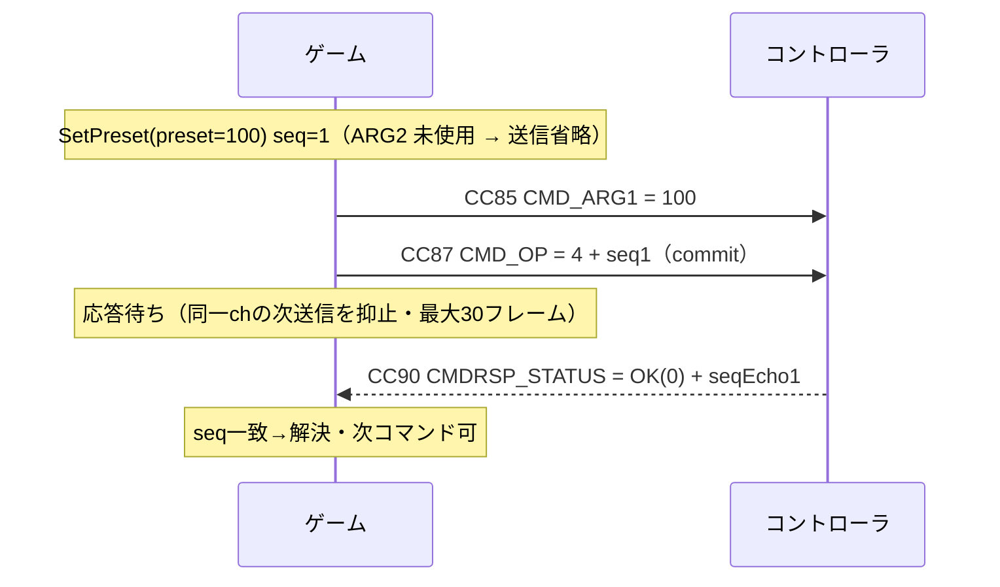
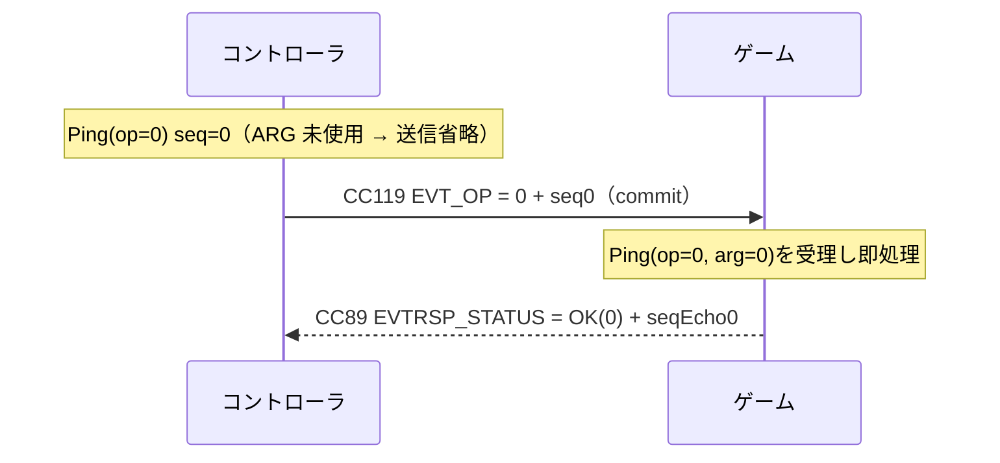
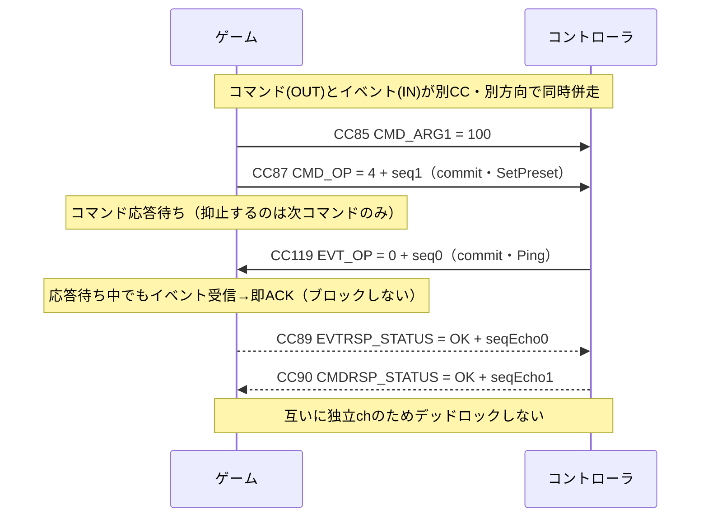
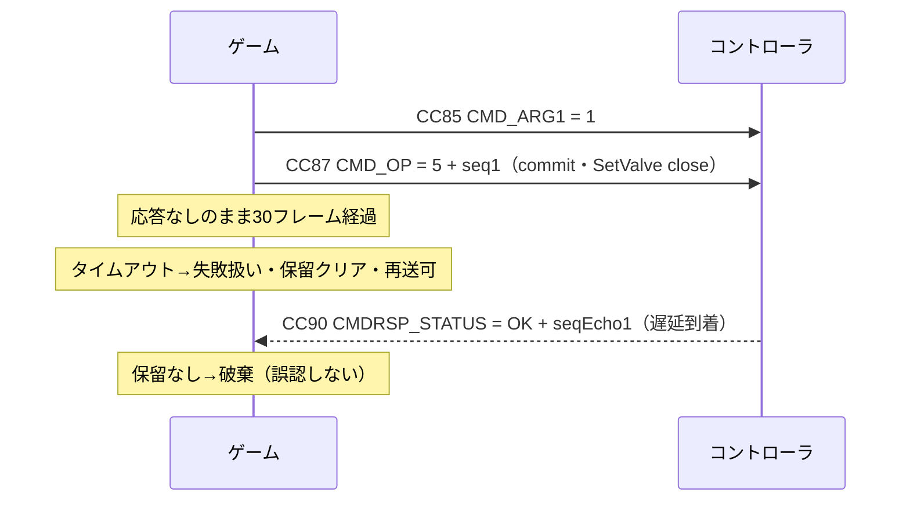

# MIDI マッピング表（Kuuhug コントローラ プロトコル仕様）

Kuuhug コントローラ ⇄ ゲーム（ホスト）間の MIDI プロトコル仕様。CC 番号の割り当て・値の解釈・イベント/応答 I/F の規約を定義する。
本書は**自己完結のプロトコル仕様**であり、ゲーム側・コントローラ（ファームウェア）側どちらの実装も本書を取り決めとして参照する。

- トランスポート: MIDI Control Change (CC) のみ（SysEx 不使用）
- MIDI チャンネル: **0**（1 始まり表記の ch1）を IN / OUT とも使用する。受信側は他チャンネルを許容してもよいが、送信は ch0 で行うこと
- 方向表記: **IN** = コントローラ → ゲーム（受信） / **OUT** = ゲーム → コントローラ（送信）
- すべて 0 始まりのインデックス（MIDI チャンネル含む）
- 最終更新: 2026-06-12

---

## 1. アナログ軸（14bit 精度・IN）

アナログ軸は **Stick**（双極・中央基準）と **Slider**（単極・0 基準）の 2 種別。
それぞれ**専用の CC ペア帯**を持つため、同一コントローラでの同時併用が可能。
どちらも 14bit 生値（0–16383）の再構成までは共通で、**正規化の解釈だけが異なる**。

| 種別   | 物理デバイス | CC ペア帯     | 生値の解釈      | 正規化範囲    |
| ------ | ------------ | ------------- | --------------- | ------------- |
| Stick  | ジョイスティック | 20–23 / 52–55 | 中央 8192 が原点 | −1.0 … +1.0   |
| Slider | スライダー / フェーダー | 24–31 / 56–63 | 0 が最小・16383 が最大 | 0.0 … 1.0 |

### 1-A. Stick（双極・−1.0 … +1.0）

各軸は **MSB / LSB の 2 本の CC** で送られ、`14bit = MSB * 128 + LSB`（0–16383）として再構成。
中央値 `8192` を基準に `-1.0 … +1.0` へ正規化・クランプする。

> **なぜ 2 本の CC を使うのか:** MIDI の CC 値は 0–127（7bit）しか表せず、スティックには粗すぎる。
> そこで **MSB（上位 7bit）と LSB（下位 7bit）の 2 本**を組み合わせて 14bit（0–16383）の高精度にする。
>
> **LSB 番号の由来:** MIDI 標準の慣習で「CC 0–31 の MSB に対し、その番号 +32 を LSB に割り当てる」。
> 本仕様もこれに従い、左 X の MSB=20 → LSB=20+32=**52**（以降 21→53 / 22→54 / 23→55）、
> Slider1 の MSB=24 → LSB=24+32=**56**（以降 25→57 / 26→58 / 27→59）とペアになる。
> 表記 `20/52` は「MSB=20, LSB=52 のペアで 1 軸」という意味。

| 入力       | 軸 | MSB CC | LSB CC | 範囲(14bit) | 正規化後      |
| ---------- | -- | ------ | ------ | ----------- | ------------- |
| 左スティック | X  | **20** | **52** | 0–16383     | −1.0 … +1.0   |
| 左スティック | Y  | **21** | **53** | 0–16383     | −1.0 … +1.0   |
| 右スティック | X  | **22** | **54** | 0–16383     | −1.0 … +1.0   |
| 右スティック | Y  | **23** | **55** | 0–16383     | −1.0 … +1.0   |

**正規化式（双極）:**

```
v = MSB * 128 + LSB            // 0 … 16383
n = (v - 8192) / 8192          // 中央 8192 を 0 に
result = clamp(n, -1.0, +1.0)
```

### 1-B. Slider（単極・0.0 … 1.0）

スライダー / フェーダー型コントローラ向け。Stick とは独立した専用 CC ペアを使い、
**0–16383 の生値を 0.0 … 1.0 に線形正規化**する。

| Slider  | 14bit (MSB / LSB) | 生値    | 正規化      |
| ------- | ----------------- | ------- | ----------- |
| Slider1 | CC 24 / 56        | 0–16383 | 0.0 … 1.0   |
| Slider2 | CC 25 / 57        | 0–16383 | 0.0 … 1.0   |
| Slider3 | CC 26 / 58        | 0–16383 | 0.0 … 1.0   |
| Slider4 | CC 27 / 59        | 0–16383 | 0.0 … 1.0   |

**正規化式（単極）:**

```
v = MSB * 128 + LSB                  // 0 … 16383
result = clamp(v / 16383, 0.0, 1.0)  // 0.0 … 1.0
```

#### スライダー予約帯（CC 24–31 / 56–63）

将来のスライダー追加に備え、**CC 24–31（MSB）/ 56–63（LSB）の 8 ペアをスライダー専用の帯**とする。
これにより最大 8 本まで、他の割り当てを崩さず拡張できる。

| Slider | CC ペア      | 状態          |
| ------ | ------------ | ------------- |
| 1–4    | 24/56 – 27/59 | 使用中        |
| 5–8    | 28/60 – 31/63 | 予約（未使用） |

> ※スライダー帯は MIDI 1.0 の**未定義 CC ペア**（MSB=24–31 / LSB=56–63）のみを使う。
> 汎用 MIDI 機器（シンセ・DAW 等）へそのままルーティングしても、バンクセレクト・モジュレーション・
> データエントリ・ボリューム・パン等の定義済み CC として解釈されないことを優先する。

---

## 2. ボタン（12 個・IN）

ボタン 0–11 は単一 CC。値が **しきい値 64 以上で ON**、未満で OFF。
ワイヤ上を流れるのは ON/OFF のレベル情報のみで、Down/Up エッジの検出は受信側実装の責務。
ボタン帯は **CC 102–113 の 12 本**で確定とし、予約帯は設けない。

| ボタン | CC | ON 条件        |
| ------ | -- | -------------- |
| 0      | 102 | value ≥ 64     |
| 1      | 103 | value ≥ 64     |
| 2      | 104 | value ≥ 64     |
| 3      | 105 | value ≥ 64     |
| 4      | 106 | value ≥ 64     |
| 5      | 107 | value ≥ 64     |
| 6      | 108 | value ≥ 64     |
| 7      | 109 | value ≥ 64     |
| 8      | 110 | value ≥ 64     |
| 9      | 111 | value ≥ 64     |
| 10     | 112 | value ≥ 64     |
| 11     | 113 | value ≥ 64     |

---

## 3. パラメータ（0–127・IN）

コントローラ側の状態値を、単一 CC・**0–127 の生値**で受信する（量子化なし）。
パラメータ帯は **CC 114–117** とする。

| パラメータ | CC      | MIDI 範囲 | 内容 |
| ---------- | ------- | --------- | ---- |
| State      | **114** | 0–127     | 状態コード（コード値の定義は別途） |
| Mode       | **115** | 0–127     | 現在の動作モード。値体系は SetMode（§5）と共通（0=通常 / 110=バージョンアップ / 127=出荷検査） |
| Error      | **116** | 0–127     | エラーコード（コード値の定義は別途） |
| Preset     | **117** | 0–127     | 現在の Preset 番号 |

- **送信契機**: コントローラは各パラメータを**接続直後（現在値の初期通知）**と**値の変化時**に送信する。ゲーム側は受信を常時受け付ける（ゲームから再送を要求する仕組みは無い）。
- Preset の**送信**は本帯ではなく SetPreset コマンド（§4・OUT）で行う（送受信非対称）。

---

## 4. Preset 送信（OUT・SetPreset コマンド）

Preset 送信は専用 CC ではなく、イベント/応答 I/F（§5）の **SetPreset コマンド**（opcode = 4）として送る（ACK 付き）。
構成 CC は 2 本（引数 1 本 + commit）。ARG2（CC86）は**未使用**：

| 役割            | CC  | 値                | 意味         |
| --------------- | --- | ----------------- | ------------ |
| arg1 (CMD_ARG1)  | 85 | 0–127             | Preset 値    |
| arg2 (CMD_ARG2) | 86 | 未使用（0）       | —            |
| commit (CMD_OP) | 87 | opcode 4 + seq×64 | SetPreset 確定 |

- 送信順 `ARG1 → OP`（ARG2 は未使用のため送信省略可・送る場合は 0。受信側は 0 と解釈する）。コントローラは `CMDRSP_STATUS`(CC90) で ACK（`0 OK` / `2 INVALID_ARG`）を返す。
- `2 INVALID_ARG` は、コントローラが **preset 値を自機の対応範囲外と判断した場合**に返されうる（対応範囲はコントローラ実装依存）。
- 送受信は**非対称**：Preset 受信は生 CC117（§3・IN）、送信は本コマンド（OUT）。
- **成功時の新値通知**：SetPreset 成功で Preset が変化した場合、§3 の送信契機（変化時）に従い CC117 で新しい現在値が通知される。現在値と同じ値を設定した場合は変化が無いため通知されない。

---

## 5. イベント/応答 I/F（双方向メッセージング）

ゲーム⇄コントローラで構造化メッセージをやり取りするための I/F。
**同期・単一メッセージ + 1bit シーケンス**方式で、CC のみを使う（SysEx 不要）。

- **コマンド**: ゲーム→コントローラの要求。コントローラが応答（ACK）を返す。
- **イベント**: コントローラ→ゲームの要求。ゲームが応答（ACK）を返す。
- コマンド系とイベント系は**別 CC・別方向の独立チャンネル**で、同時併走（クロス）しても安全。

### フレーム構成

- **コマンド要求フレーム（OUT）** = `(ARG1, ARG2, OP)` … OP の到着が commit（`ARG2` は任意・既定 0）
- **イベント要求フレーム（IN）** = `(ARG, OP)` … OP の到着が commit（引数は 1 本のみ＝コマンドの `ARG1` に相当・CC 名は `EVT_ARG`。ARG2 に相当する CC は無い）
- **応答フレーム（双方向）** = `(STATUS)` … STATUS の到着が commit

OP / STATUS の値に **bit6（値 64）をシーケンスビット**として埋め込む（本体は bit0–5 = 0–63）：

```
OP 値      = opcode(0–63) + seq×64
STATUS 値  = status(0–63) + seqEcho×64
```

- **seq（要求側が設定）**: 1bit のシーケンス番号。要求側が要求を送るたびに **0↔1 を反転**させて OP に載せる（初期値は任意）。
- **seqEcho（応答側が設定）**: 応答側が**受信した要求 OP の seq をそのまま写して** STATUS に載せる値。応答側が新たに生成・反転することはない。要求側は「自分が送った seq」と「応答の seqEcho」の一致で要求と応答を対応付け、不一致なら古い（タイムアウト済み要求への）応答とみなして破棄する。

### CC 割り当て（CC 85–90 / 118–119 帯・使用 7 本 + 未使用 1 本）

**OUT（ゲーム→コントローラ）** — コマンド系（85–87）は送信順＝CC 番号順。CC88 は High Resolution Velocity Prefix のため使用しない。

| CC | 名称 | 値の構成 | 設定する値（誰が・何を） | commit |
| -- | ---- | -------- | ------------------------ | ------ |
| 85 | CMD_ARG1 | 第1引数 0–127 | ゲームが設定。コマンドの第1引数。**意味は opcode ごとに定義**（→「コード値」opcode 表。例: SetPreset では preset 値） | |
| 86 | CMD_ARG2 | 第2引数 0–127（任意・既定0） | ゲームが設定。コマンドの第2引数。第2引数を使わない opcode では送信省略可（受信側は 0 と解釈）。**現行の確定 opcode ではいずれも未使用**（将来拡張用） | |
| 87 | CMD_OP | opcode(0–63) + seq×64 | ゲームが設定。opcode = 実行させたい操作の番号（→「コード値」opcode 表・方向 G→C / G⇄C のもの）、seq = ゲームがコマンド送信ごとに 0↔1 反転 | ✓ |
| 89 | EVTRSP_STATUS | status(0–63) + seqEcho×64 | ゲームが設定。受信したイベント（CC118/119）への応答。status = 処理結果（→「コード値」STATUS 表。0=OK / 1 以上=NG）、seqEcho = 受信した EVT_OP の seq をそのまま返す | ✓ |

**IN（コントローラ→ゲーム）**

| CC | 名称 | 値の構成 | 設定する値（誰が・何を） | commit |
| -- | ---- | -------- | ------------------------ | ------ |
| 90 | CMDRSP_STATUS | status(0–63) + seqEcho×64 | コントローラが設定。受信したコマンド（CC85–87）への応答。status = 処理結果（→「コード値」STATUS 表。0=OK / 1 以上=NG）、seqEcho = 受信した CMD_OP の seq をそのまま返す | ✓ |
| 118 | EVT_ARG | 引数 0–127 | コントローラが設定。イベントの引数。**意味は opcode ごとに定義**（→「コード値」opcode 表） | |
| 119 | EVT_OP | opcode(0–63) + seq×64 | コントローラが設定。opcode = 通知する操作の番号（→「コード値」opcode 表・方向 C→G / G⇄C のもの）、seq = コントローラがイベント送信ごとに 0↔1 反転 | ✓ |

- **CC 88 は未使用**（MIDI 1.0 で High Resolution Velocity Prefix として定義されているため割り当てない）。
- **IN / OUT で CC 番号の重複なし**：本仕様の全割り当て（スティック・ボタン・パラメータ・イベント系）は、IN と OUT で同一番号を共有しない。ループバック / 単一仮想ポートで疎通試験しても、自分が送った OUT が他入力（スティック等）として誤注入されることはない。

### 送受信規約

- 送信は `ARG →(ARG2)→ OP` の順（`ARG2` はコマンドのみ・イベントは `ARG` 1 本）。受信側は **OP の到着ごと**に直前の ARG/ARG2 と合わせて 1 件として実行し、**実行後に ARG/ARG2 を消費（クリア）** する（次の要求で送られなかった引数は 0。前の要求の値は残さない）。送信側は各要求で必要な引数を毎回送る。値変化ではなく CC メッセージ到着で発火するため、同値連続の要求も取りこぼさない。
- 送信側は要求ごとに **seq を 0↔1 反転**する。応答の seqEcho が保留中の seq と一致しなければ**破棄**（タイムアウト後に遅れて来た古い応答の誤認を防ぐ）。
- **「応答待ち」がブロックするのは同一チャンネルの次送信のみ**。相手からの受信・応答は常時実行する（クロス時もデッドロックしない）。
- 保留要求の無いチャンネルに届いた応答（STATUS）は破棄する。
- 応答のタイムアウト既定は **30 フレーム（≒0.5s @60fps）**。ここでの「フレーム」は**送信側の処理サイクル（毎フレーム実行される送受信処理）の回数**であり、**実時間ではない**。送信側の処理が停止・間引きされている間はタイムアウトも進まないため、実時間 0.5 秒の応答期限を保証するものではない（応答側は即時 ACK を返すこと。実時間の期限には依存しない）。超過で失敗扱いとし、その後に再送可。
- 状態を書き換えるコマンド（例 SetPreset）は **last-write-wins**。1bit seq の稀な誤認（後述「2 連続タイムアウト＋超遅延応答」）が起きても次回送信で上書き訂正され恒久的な不整合は残らない。厳密な一回性が要る用途は 2bit seq 等への拡張を検討。

### コード値

**STATUS（bit0–5）** — 応答フレーム（CMDRSP_STATUS / EVTRSP_STATUS）の bit0–5 に設定する処理結果コード。
**0 のみが成功（OK）で、1 以上はすべて失敗（NG）**。NG の内訳が 1–3。
コマンド応答（CC90）ではコントローラが、イベント応答（CC89）ではゲームが設定する。

| 値 | 名称 | 意味 | 設定する場面 |
| -- | ---- | ---- | ------------ |
| 0 | OK | 受領/完了（成功） | 要求を正常に受理・処理した |
| 1 | UNKNOWN_OP | 未知オペコード（NG） | 受信した opcode を実装していない・知らない |
| 2 | INVALID_ARG | 引数不正（NG） | opcode は既知だが ARG1/ARG2 の値が範囲外・不正 |
| 3 | REJECTED | 拒否（NG） | 引数は正しいが現在の状態では実行できない（ビジー・モード不一致等） |
| 4–63 | — | 予約 | 将来拡張用。受信側は未知の値を NG として扱うこと |

**opcode（bit0–5・コマンド/イベント共通の番号空間）** — 各 opcode に**方向**を定義し、方向によって使う経路（CC）が決まる：

- **G→C（ゲーム→コントローラ）**: コマンド経路で送る — 要求 = CC85(ARG1) / CC86(ARG2) / CC87(OP)、応答 = CC90
- **C→G（コントローラ→ゲーム）**: イベント経路で送る — 要求 = CC118(ARG1) / CC119(OP)（ARG2 相当なし）、応答 = CC89
- **G⇄C（双方向）**: どちらからも送れる。ゲーム発はコマンド経路・コントローラ発はイベント経路を使う（独立チャンネルのため同時併走可）

| OP | 名称 | 方向 | ARG1 | ARG2 | 応答 status | 説明 |
| -- | ---- | ---- | ---- | ---- | ----------- | ---- |
| 0 | Ping | **G⇄C（双方向）** | 未使用（0） | 未使用（0） | OK(0) | 疎通確認。受信側は即 OK を返す |
| 1 | Reset（リセット） | G→C | 未使用（0） | 未使用（0） | OK(0) — **ACK 送信後にリセット実行** | コントローラを再起動・初期化 |
| 2 | SetMode（モード設定） | G→C | **0 = 通常モード / 110 = バージョンアップモード / 127 = 出荷検査モード**（それ以外は不正） | 未使用（0） | OK(0) / INVALID_ARG(2) / REJECTED(3) — **ACK 送信後にモード遷移** | 動作モードの切替 |
| 3 | SetZero（Zero設定） | G→C | 未使用（0） | 未使用（0） | OK(0) / REJECTED(3) | センサの零点（基準値）を現在値で設定 |
| 4 | SetPreset（プリセット設定） | G→C | preset **0–127** | 未使用（0） | OK(0) / INVALID_ARG(2) | プリセット設定（§4 参照） |
| 5 | SetValve（バルブ制御） | G→C | **0 = open / 1 = close**（それ以外は不正） | 未使用（0） | OK(0) / INVALID_ARG(2) / REJECTED(3) | バルブの開閉を指示 |
| 6–63 | 予約 | — | — | — | — | 将来拡張用 |

> **採番方針**: 「疎通（0=Ping）→ デバイス管理（1=Reset・2=SetMode）→ 設定（3=SetZero・4=SetPreset）→ 動作（5=SetValve）」の階層順。
> 以後の追加は **6 以降の若番から順に**採番する（表の行はカテゴリ順を保って並べる）。既存番号の振り直しは対向実装の開始後は不可。

共通規約:

- 応答 status 列は「その opcode を実装した受信側」が返しうる値。**opcode 未実装の受信側は一律 UNKNOWN_OP(1)** を返す（全 opcode 共通のため各行には書かない）
- **使用する** ARG が定義域外の場合は INVALID_ARG(2) を返し、**受信側の状態を変更しない**
- 未使用の ARG は 0 を送る（送信省略も可・受信側は 0 と解釈する。§送受信規約参照）。**受信側は未使用 ARG の値を検証しない**（0 以外が届いても無視し、INVALID_ARG にはしない）
- 新しい status コードが必要になった場合は STATUS 表の予約帯 4–63 から採番する

SetMode（2）の補足:

- **モード遷移は一方向**：バージョンアップモード（110）／出荷検査モード（127）へ遷移すると**通常モードへは戻れない**（`SetMode(0)` による復帰も不可。ARG1 = 0 は通常モードの値定義であり、復帰用途には使えない）
- 遷移後は MIDI 応答ができなくなる可能性があるため、**ACK（OK）を送信してから遷移する**（Reset と同じ規約）
- バージョンアップモード／出荷検査モード中の本プロトコルの動作は**未規定**（本仕様は通常モードを対象とする）
- **Mode（CC115・§3）への反映**: SetMode 成功でモードが変化した場合、§3 の送信契機（変化時）に従い CC115 で新しい動作モードが通知される。ただしバージョンアップ／出荷検査モードへの遷移直後は MIDI 送信を継続できない可能性があり、**遷移後の CC115 通知は保証されない**（前項のとおり遷移後の動作は未規定）

### クロス時の挙動

| ケース | 挙動 |
| ------ | ---- |
| コマンドとイベントが同時併走 | 別 CC・別方向のため安全。各側は応答待ち中も受信ハンドラを生かし即応答 |
| タイムアウト→単発の遅延応答 | seq 不一致で破棄され誤認しない |
| 2 連続タイムアウト＋超遅延応答 | 稀に誤認余地が残る（1bit seq の限界・低頻度前提で許容） |

### シーケンス図

矢印は CC メッセージ。実線=要求、破線=応答(ACK)。`commit` は OP/STATUS 到着で 1 件確定。

> **表記:** `seq1` / `seqEcho1` は「seq = 1」「seqEcho = 1」（bit6 = 1、すなわち +64）の意味（`seq0` / `seqEcho0` なら +0）。
> 例: `CMD_OP = 4 + seq1` のワイヤ上の実値は `4 + 64 = 68`、`CMDRSP_STATUS = OK(0) + seqEcho1` は `0 + 64 = 64`。
> 応答側は受信した OP の seq をそのまま seqEcho に写す（§フレーム構成）ため、要求が `seq1` なら応答は必ず `seqEcho1` になる。

#### コマンド送受信（例: SetPreset + ACK）



#### イベント送受信（例: Ping・コントローラ→ゲーム + 即 ACK）



#### クロス（コマンドとイベントの同時併走・デッドロックしない）



#### タイムアウトと遅延応答の破棄



---

## 早見表（CC 一覧）

> **帯設計の方針**: 汎用 MIDI / GM 音源 / DAW へそのままルーティングしても副作用が出にくいよう、
> MIDI 1.0 の**未定義 CC**のみへ割り当てる。
> 14bit アナログ軸は未定義 MSB（20–31）と、その標準 LSB 対（52–63）を使う。
> 単一 CC は未定義の 85–87 / 89–90 / 102–119 を使い、High Resolution Velocity Prefix の CC88 は使わない。
> バンクセレクト・モジュレーション・ボリューム・パン・ペダル・サウンドコントローラ・エフェクトセンド・
> NRPN/RPN・チャンネルモード等の定義済み CC には割り当てない。

| CC      | 用途                       | 方向 |
| ------- | -------------------------- | ---- |
| 20 / 52 | 左スティック X (MSB / LSB) | IN   |
| 21 / 53 | 左スティック Y (MSB / LSB) | IN   |
| 22 / 54 | 右スティック X (MSB / LSB) | IN   |
| 23 / 55 | 右スティック Y (MSB / LSB) | IN   |
| 24 / 56 | Slider1 (MSB / LSB)        | IN   |
| 25 / 57 | Slider2 (MSB / LSB)        | IN   |
| 26 / 58 | Slider3 (MSB / LSB)        | IN   |
| 27 / 59 | Slider4 (MSB / LSB)        | IN   |
| 28–31 / 60–63 | Slider5–8（予約・未使用） | IN   |
| 85      | CMD_ARG1 (コマンド第1引数)   | OUT |
| 86      | CMD_ARG2 (コマンド第2引数)   | OUT |
| 87      | CMD_OP (コマンド op+seq)    | OUT |
| 88      | 未使用（High Resolution Velocity Prefix のため割り当て禁止） | — |
| 89      | EVTRSP_STATUS (イベント応答) | OUT |
| 90      | CMDRSP_STATUS (コマンド応答) | IN |
| 102–113 | ボタン 0–11                | IN   |
| 114     | State (受信・0–127)        | IN   |
| 115     | Mode (受信・0–127)         | IN   |
| 116     | Error (受信・0–127)        | IN   |
| 117     | Preset (受信・0–127)       | IN   |
| 118     | EVT_ARG (イベント引数)      | IN   |
| 119     | EVT_OP (イベント op+seq)    | IN   |
